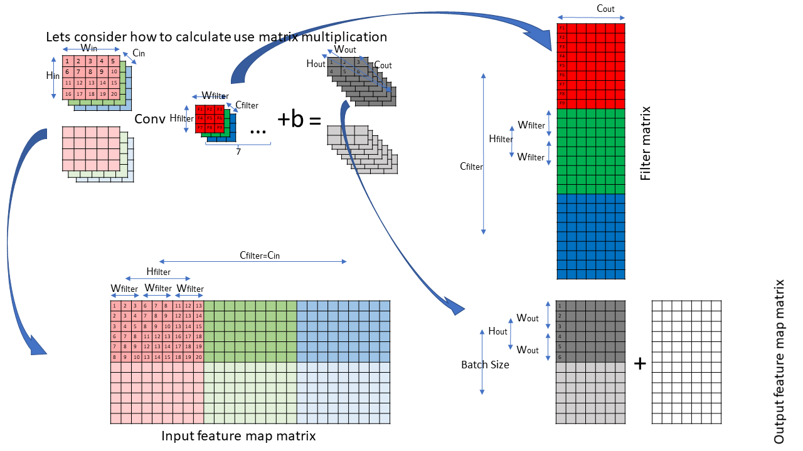

# CNN with Numpy
This is the NumPy implementation of CNN, including Conv FC Dropout and BN layer, etc.

## Reconstruct
1. The project has been tested on MNIST with almost the same accuracy as Tensorflow did, but three years ago.
2. I am now trying to reconstruct it to follow up with the new technology used in CNN.
3. I want to add some detailed image descriptions to each structure of CNN.
4. I will reconstruct the new code in the new folder, such as "layers" and "initializers".
5. Anyone wants to help me?

## Example of image descriptions
| structure  |   image descriptions   |  dir   |
| ----        |  ----    |  ----    | 
| CNN |  | layers/Conv/README.md |

