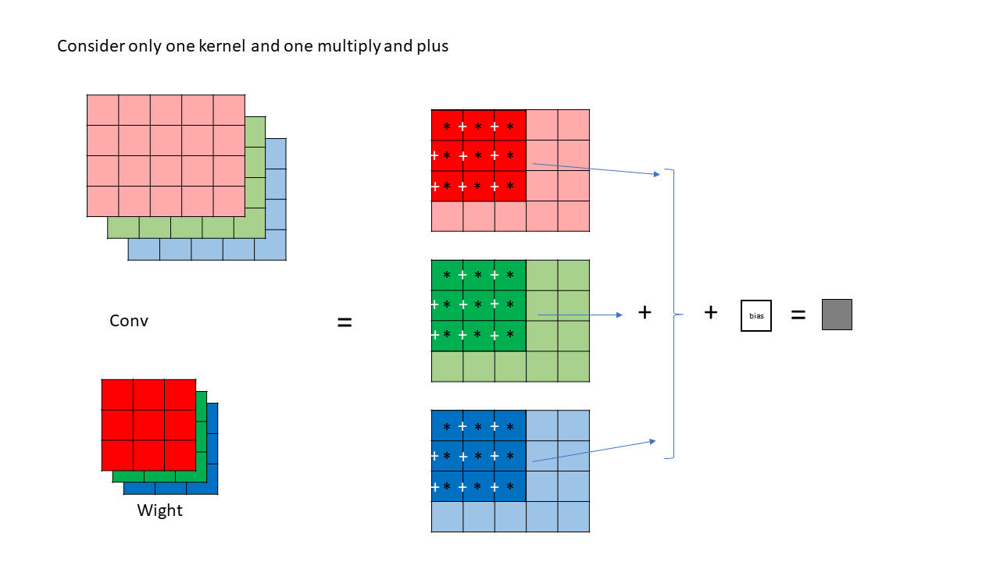
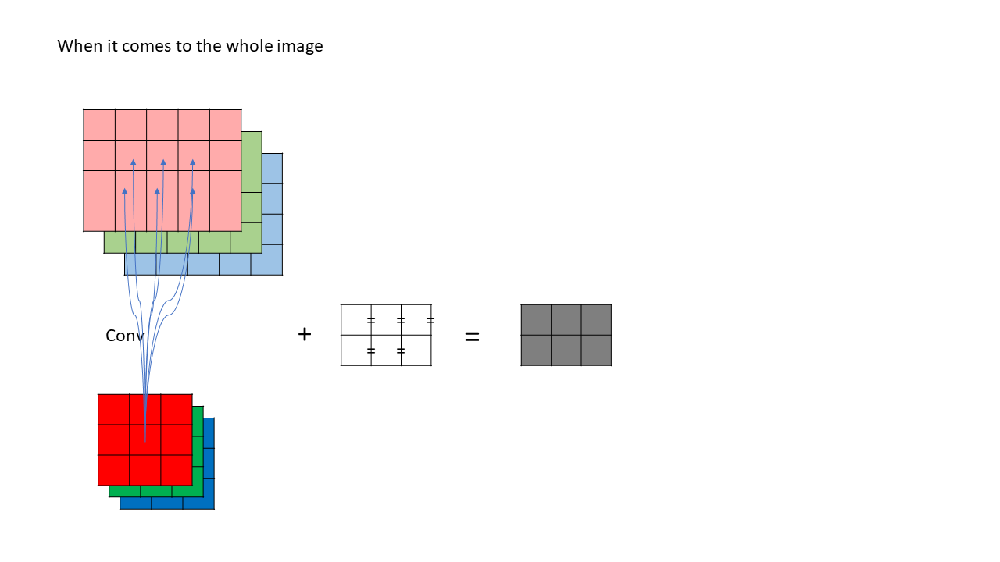
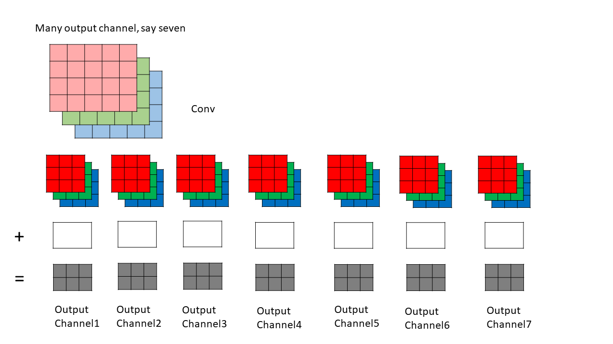
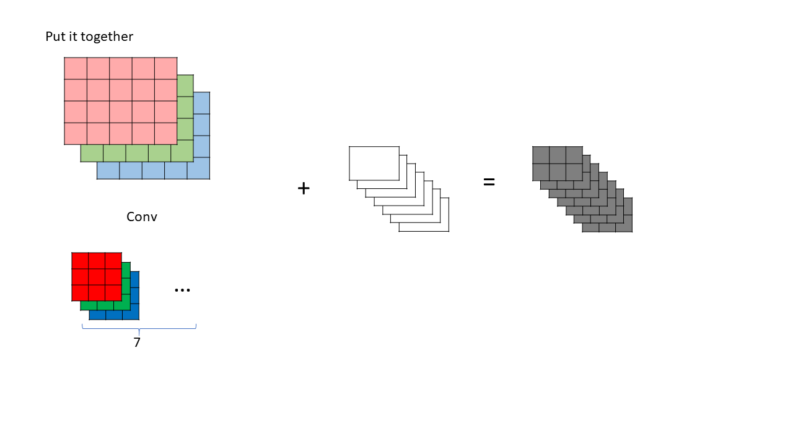
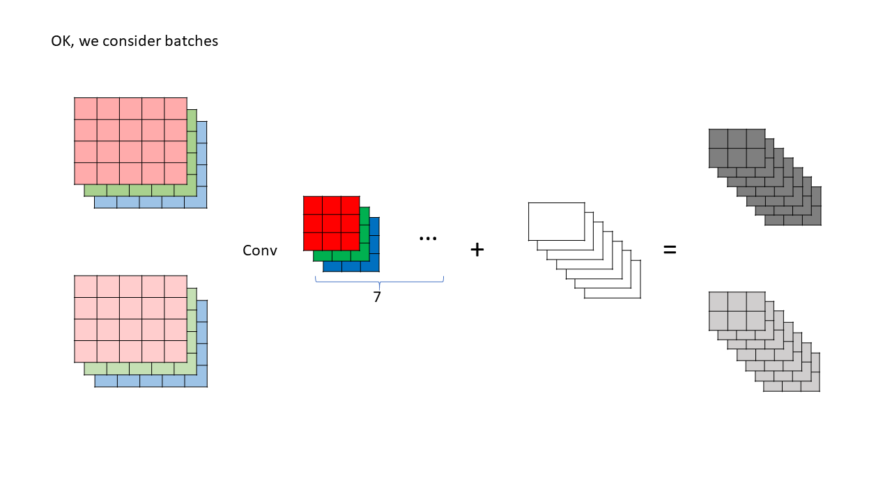
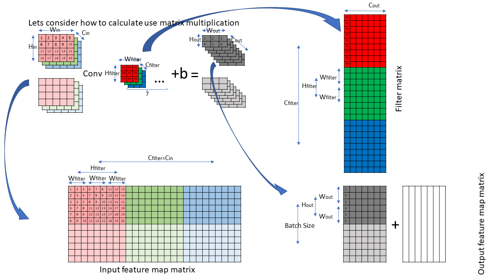

## Conv
1. Explain the concept of convolution neural networks in deep learning.
2. Explain how to implement CNN with matrix multiplication.

## Explain Slides

| Explain Slides  | 
| ----        |
|  | 
|  | 
|  | 
|  | 
|  | 
|  | 

